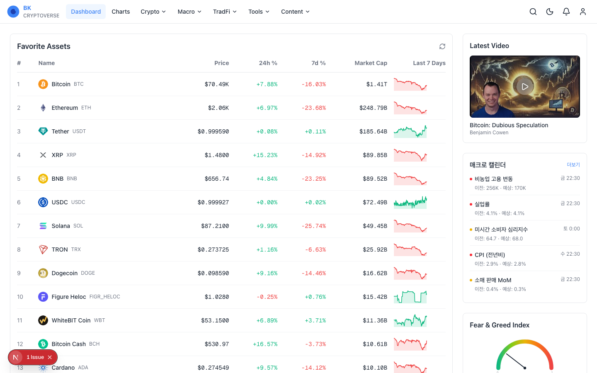
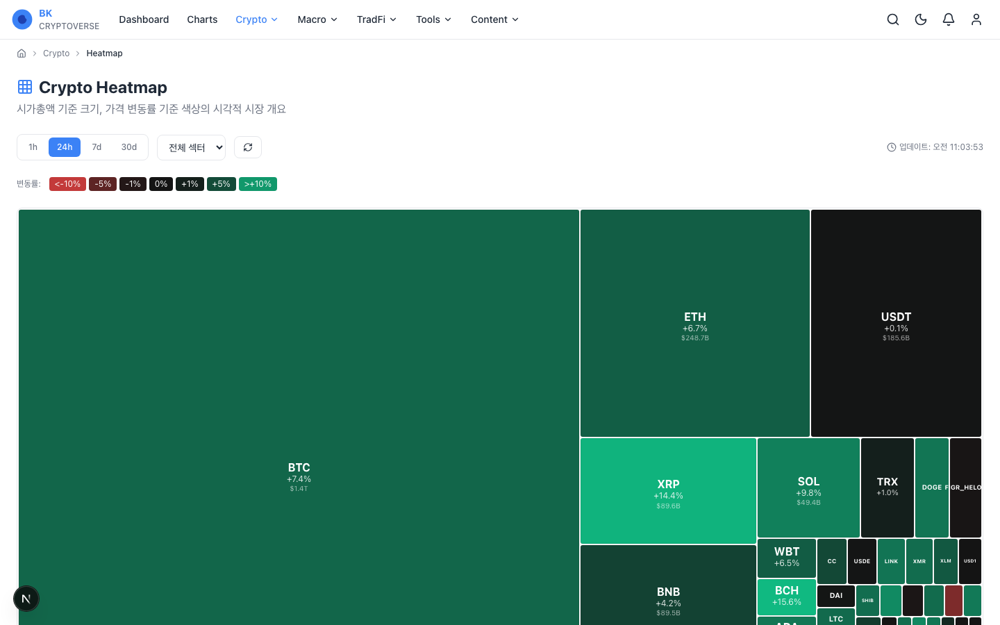
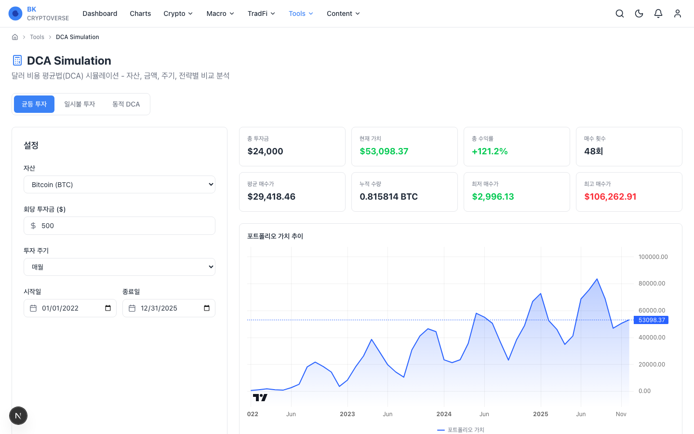
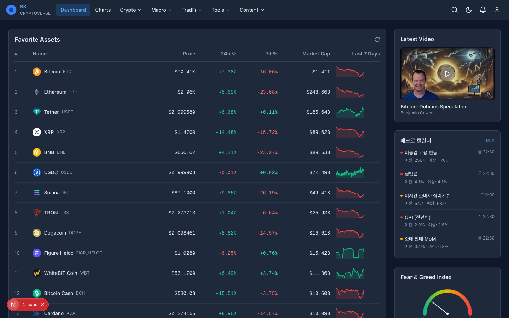
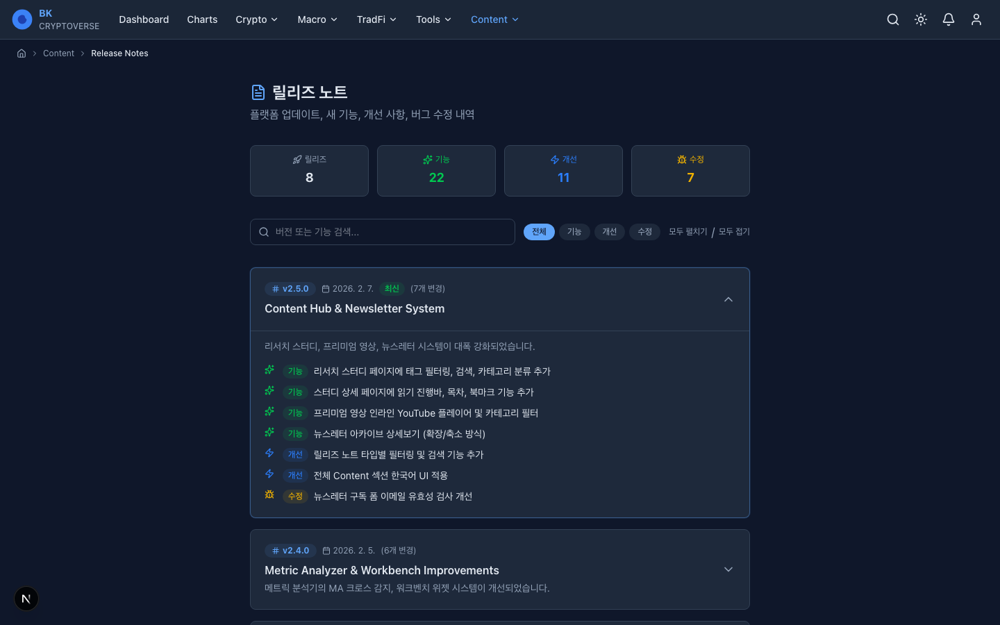
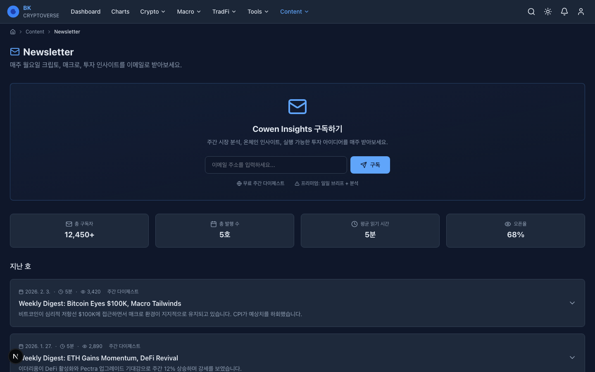

# BK Cryptoverse

**종합 투자 분석 플랫폼** - 크립토, 매크로, 전통 금융을 아우르는 풀 기능 웹 애플리케이션


## Screenshots

### Light Mode
| Dashboard | Crypto Heatmap | DCA Simulation |
|-----------|---------------|----------------|
|  |  |  |

### Dark Mode
| Dashboard | Release Notes | Newsletter |
|-----------|--------------|------------|
|  |  |  |

## Features

### Dashboard
- 실시간 암호화폐 가격 테이블 (CoinGecko API, 20+ 자산, 스파크라인)
- Crypto Risk / Macro Recession Risk 게이지 차트
- 시가총액 차트 (Total/BTC/ETH, 로그 스케일)
- 도미넌스 차트 (BTC.D/ETH.D)
- 자산별 리스크, 매크로 지표 (실업률/인플레이션/RGDP/기준금리)
- 사이드바: 최신 영상, 매크로 캘린더, Fear & Greed, Quick Links

### Charts (100+ 차트)
- 좌측 사이드바: Crypto / Macro / TradFi 탭, 카테고리 트리, 검색, 즐겨찾기
- 차트 상세 페이지: TradingView Lightweight Charts, 로그 스케일
- 3컬럼 카드 그리드 (Crypto / Macro / TradFi)

### Crypto
- **Screener** - 정렬 가능 테이블, 실시간 API 연동, CSV 내보내기
- **Indicator Dashboard** - 게이지 차트, 14개 리스크 지표, 카테고리 필터
- **Heatmap** - D3.js treemap, 시총 기준 크기, 등락률 색상, 섹터 필터
- **Treasuries** - Bitcoin/Ethereum/Solana 탭, ETF 테이블, 도넛 차트

### Tools
- **DCA Simulation** - 3가지 전략 (균등/일시불/동적 DCA), TradingView 차트
- **Exit Strategies** - 리스크 밴드 매트릭스, 커스텀 래더, 수익 계산
- **Modern Portfolio Theory** - Monte Carlo 시뮬레이션, 효율적 프론티어
- **Portfolio Strategy Tester** - 백테스트 엔진, 전략 비교, CAGR/Sharpe/Sortino
- **Weighted Risk** - 온체인 지표 가중치 커스터마이징, 포트폴리오 도넛 차트
- **Workbench** - 커스텀 위젯 대시보드, localStorage 저장
- **Metric Analyzer** - MA 크로스 감지, Forward Returns, 상관관계 매트릭스

### Content
- **Research Studies** - 태그/카테고리 필터, 검색, 프리미엄 뱃지, 상세 페이지 (목차, 읽기 진행바)
- **Premium Videos** - YouTube 임베드 플레이어, 카테고리 필터, 정렬
- **Newsletter** - 이메일 구독, 아카이브 상세보기 (센티먼트 표시)
- **Release Notes** - 타입별 필터 (기능/개선/수정), 검색, 통계 카드
- **Video Summaries** - YouTube 영상 요약 + Notion 연동

### UX & Accessibility
- 다크/라이트 모드 (next-themes)
- 반응형 디자인 (데스크톱/태블릿/모바일)
- 스켈레톤 로딩, 에러 바운더리, 404 페이지
- Skip-to-content, ARIA labels, 키보드 네비게이션
- Breadcrumb, ScrollToTop, Toast 알림
- Footer, 프린트 스타일, SEO 메타데이터

## Tech Stack

| Layer | Technology | Purpose |
|-------|-----------|---------|
| Framework | Next.js 16 (App Router) | SSR, 라우팅, API Routes |
| Language | TypeScript 5 | 타입 안전성 |
| Styling | Tailwind CSS 4 | 유틸리티 기반 스타일링 |
| Charts | TradingView Lightweight Charts | 캔들스틱, 라인, 영역 차트 |
| Heatmap | D3.js (treemap) | 크립토 히트맵 |
| State | TanStack Query | 서버 데이터 캐싱 |
| Icons | Lucide React | 아이콘셋 |
| Theme | next-themes | 다크/라이트 모드 |

## API Routes

| Endpoint | Source | Cache |
|----------|--------|-------|
| `/api/crypto/prices` | CoinGecko | 60초 |
| `/api/crypto/market-cap` | CoinGecko | 5분 |
| `/api/crypto/dominance` | CoinGecko | 5분 |
| `/api/crypto/heatmap` | CoinGecko | 120초 |
| `/api/macro/indicators` | FRED API | 6시간 |
| `/api/crypto/events` | CoinMarketCal | 1시간 |
| `/api/notion/save-summary` | Notion API | - |
| `/api/youtube/transcript` | YouTube oEmbed | - |

> 모든 API는 키 없이도 샘플 데이터 fallback을 제공합니다.

## Getting Started

### Prerequisites
- Node.js 18+
- npm or yarn

### Installation

```bash
git clone https://github.com/jangbk/jangbk-platform.git
cd jangbk-platform
npm install
```

### Environment Variables (Optional)

```bash
cp .env.example .env.local
```

```env
# CoinGecko (optional - free tier works without key)
COINGECKO_API_KEY=

# FRED API (free)
FRED_API_KEY=

# Notion Integration (optional)
NOTION_API_KEY=
NOTION_DATABASE_ID=
```

### Development

```bash
npm run dev
```

Open [http://localhost:3000](http://localhost:3000)

### Production Build

```bash
npm run build
npm start
```

## Project Structure

```
src/
├── app/
│   ├── api/                    # 7 API Routes
│   ├── charts/                 # Charts (layout + 3 grids + [chartId])
│   ├── content/                # Studies, Videos, Newsletter, Release Notes
│   ├── crypto/                 # Screener, Indicators, Heatmap, Treasuries
│   ├── dashboard/              # Main dashboard
│   ├── macro/                  # Indicators, Calendar
│   ├── tools/                  # 9 analysis tools
│   ├── tradfi/                 # Indexes, Stocks, Metals
│   ├── layout.tsx              # Root layout (Header, Footer, Breadcrumb)
│   ├── loading.tsx             # Global loading skeleton
│   ├── error.tsx               # Error boundary
│   └── not-found.tsx           # 404 page
├── components/
│   ├── dashboard/              # LightweightChartWrapper
│   ├── layout/                 # Header, Footer, ThemeProvider, ThemeToggle
│   └── ui/                     # GaugeChart, SparklineChart, Breadcrumb, Toast, ScrollToTop
├── data/                       # Chart catalog (100+ charts)
└── lib/                        # Utils, constants, types, formatters
```

## Routes (41 total)

<details>
<summary>Click to expand all routes</summary>

| Route | Description |
|-------|-------------|
| `/dashboard` | 메인 대시보드 |
| `/charts` | 차트 카탈로그 |
| `/charts/crypto` | 크립토 차트 그리드 |
| `/charts/macro` | 매크로 차트 그리드 |
| `/charts/tradfi` | TradFi 차트 그리드 |
| `/charts/[chartId]` | 차트 상세 |
| `/crypto/screener` | 크립토 스크리너 |
| `/crypto/indicators` | 인디케이터 대시보드 |
| `/crypto/heatmap` | 히트맵 |
| `/crypto/treasuries` | 기업/ETF 보유량 |
| `/crypto/events` | 이벤트 캘린더 |
| `/macro/indicators` | 매크로 지표 |
| `/macro/calendar` | 경제 캘린더 |
| `/tradfi/indexes` | 주요 지수 |
| `/tradfi/stocks` | 주식 |
| `/tradfi/metals` | 귀금속 |
| `/tools/dca-simulation` | DCA 시뮬레이션 |
| `/tools/exit-strategies` | 출구 전략 |
| `/tools/modern-portfolio-theory` | MPT |
| `/tools/portfolio-strategy-tester` | 전략 백테스트 |
| `/tools/weighted-risk` | 가중 리스크 |
| `/tools/workbench` | 워크벤치 |
| `/tools/metric-analyzer` | 메트릭 분석기 |
| `/tools/bot-performance` | 봇 성과 |
| `/tools/backtest` | 백테스트 |
| `/content/studies` | 리서치 스터디 |
| `/content/studies/[studyId]` | 스터디 상세 |
| `/content/premium-videos` | 프리미엄 영상 |
| `/content/newsletter` | 뉴스레터 |
| `/content/release-notes` | 릴리즈 노트 |
| `/content/video-summaries` | 영상 요약 |

</details>

## License

MIT

---

Built with Next.js, TypeScript, and Tailwind CSS.
Built by JangBK.
